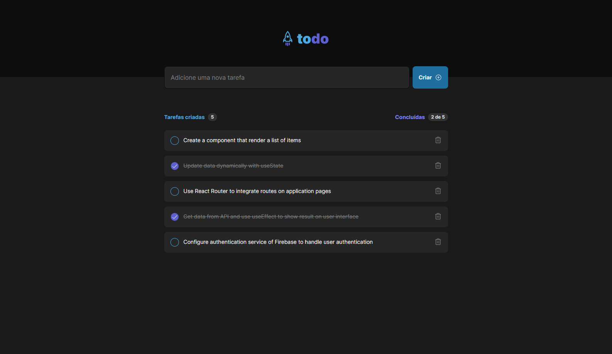

<h1 align="center">To Do List</h1>

<h2 align="center">Set your tasks. On this app you can organize your tasks and mark as complete when It's done or delete.</h2>

<p align="center">Project created with Vite, ReactJS and TypeScript.</p>



## [WebSite](https://todo-list-six-liart.vercel.app/)

<br>

<p>I've used this application to improve my knowledge with States, communication between components (properties), Typescript and Tailwindcss</p>

## Features

- [x] Create a task
- [x] Mark as completed
- [x] Show tasks progress
- [x] Save data on local storage
- [x] Delete task

## For run

NPM

```bash
npm install
npm run dev
```

YARN

```bash
yarn
yarn dev
```
